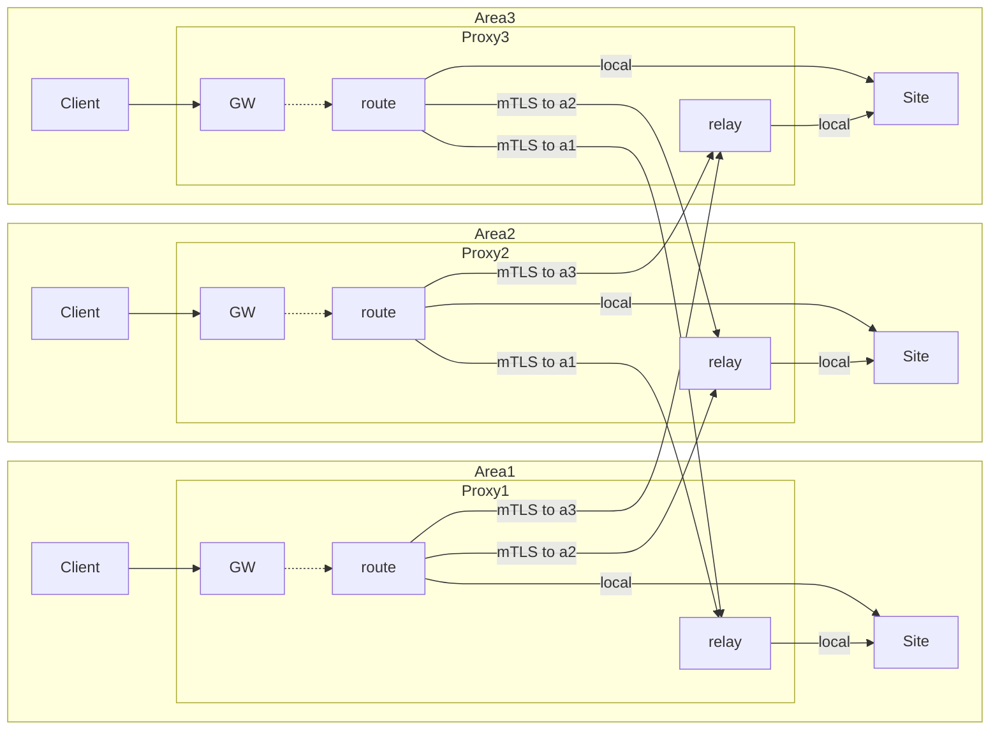
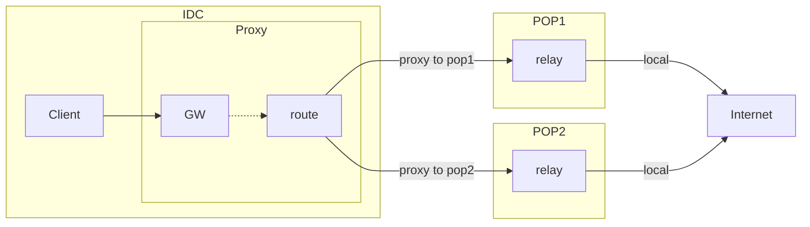

# g3proxy User Guide

**Table of Contents**

- [Installation](#installation)
- [Basic Concepts](#basic-concepts)
    + [Service Management](#service-management)
    + [Hot Upgrades](#hot-upgrades)
    + [Configuration Structure](#configuration-structure)
    + [Monitoring](#monitoring)
- [Basic Usage](#basic-usage)
    + [HTTP Proxy](#http-proxy)
    + [SOCKS Proxy](#socks-proxy)
    + [TCP Mapping](#tcp-mapping)
    + [TLS Offloading](#tls-offloading)
    + [TLS Encapsulation](#tls-encapsulation)
    + [SNI Proxy](#sni-proxy)
    + [Route Binding](#route-binding)
    + [Proxy Chaining](#proxy-chaining)
    + [Connection Throttling](#connection-throttling)
    + [Secure Resolution](#secure-resolution)
    + [Fault-Tolerant Resolution](#fault-tolerant-resolution)
    + [User Authentication and Authorization](#user-authentication-and-authorization)
    + [User Rate Limiting and Throttling](#user-rate-limiting-and-throttling)
- [Advanced Usage](#advanced-usage)
    + [mTLS Client](#mtls-client)
    + [Unloading the Guomi TLCP Protocol](#unloading-the-guomi-tlcp-protocol)
    + [Multi-Protocol Listen on One Port](#multi-protocol-listen-on-one-port)
    + [Listening on Multiple Ports](#listening-on-multiple-ports)
    + [Enabling PROXY Protocol on Listening Ports](#enabling-proxy-protocol-on-listening-ports)
    + [Guomi TLCP Protocol Encapsulation](#guomi-tlcp-protocol-encapsulation)
    + [Socks5 UDP IP Mapping](#socks5-udp-ip-mapping)
    + [Secure Reverse Proxy](#secure-reverse-proxy)
    + [Domain Name Resolution Hijacking](#domain-name-resolution-hijacking)
    + [Dynamic Route Binding](#dynamic-route-binding)
    + [Dynamic Proxy Chaining](#dynamic-proxy-chaining)
    + [Monitoring Specific Sites for Users](#monitoring-specific-sites-for-users)
    + [Traffic Audit](#traffic-audit)
    + [Exporting Decrypted TLS Traffic](#exporting-decrypted-tls-traffic)
    + [Performance Optimization](#performance-optimization)
- [Scenario Design](#scenario-design)
    + [Multi-Region Acceleration](#multi-region-acceleration)
    + [Dual Exit Disaster Recovery](#dual-exit-disaster-recovery)

## Installation

Currently, g3proxy only supports Linux systems and provides packaging and installation support for Debian, RHEL, and other distributions.
Refer to the [Release and Packaging Steps](/README.md#release-and-packaging) to package and install directly on the target system.

## Basic Concepts

### Service Management

Multiple g3proxy services can be deployed on a single machine and managed through systemd unit services. Each unit corresponds to a g3proxy process group (daemon_group),
and each process group has a Unix socket file for local RPC management.

Each service has an entry configuration file in YAML format, with a customizable suffix, but all referenced configuration files must have the same suffix. In the following text, *main.yml* will be used to refer to the entry configuration file.

For installations using native distribution packages, systemd parameterized service configuration files are already installed. The parameter is the process group name,
and the corresponding entry configuration file is located at `/etc/g3proxy/<daemon_group>/main.yml`.

For installations without using packages, you can refer to [g3proxy@.service](service/g3proxy@.latest.service) to design your own service usage.

### Hot Upgrades

The default systemd service configuration supports hot upgrades, following these steps:

1. Install the new version package.
2. Execute `systemctl daemon-reload` to load the new version service configuration.
3. Execute `systemctl restart g3proxy@<daemon_group>` to start the new process and notify the old process to go offline.

After the old process goes offline, it will wait for the existing tasks to exit or forcibly go offline after a certain period of time (default 10 hours).

The hot upgrade mechanism is similar to nginx reload. Due to operating system limitations, there is a chance that new connection requests will be dropped when sockets are released. Starting from Linux 5.14, the [tcp_migrate_req](https://docs.kernel.org/networking/ip-sysctl.html) option is introduced to ensure that connections are not lost.

### Configuration Structure

g3proxy adopts a modular approach for functionality design, mainly consisting of the following functional modules:

1. Server

    Responsible for accepting client requests and processing them, invoking the functionalities of the Egress, User, and Audit modules.
    Entry of type *Port* can be placed before non-port type entries for chaining.

2. Escaper

    Responsible for connecting to and controlling the target address, invoking the functionalities of the Resolver module.
    Egress of type *Route* can be placed before other egresses for chaining.

3. Resolver

    Provides domain name resolution functionality.
    Failover resolution can be placed before other resolvers for chaining.

4. UserGroup

   Provides user authentication and authorization functionality.

5. Auditor

   Provides traffic auditing functionality.

The configuration for these modules can be written together with *main.yml* or managed using separate configuration files, which allows for independent reloading.

In addition to the configuration for the above modules, including threads/logs/monitoring, all need to be written in *main.yml*.

For a single file configuration, refer to [examples/inspect_http_proxy](examples/inspect_http_proxy),
For a split file configuration, refer to [examples/hybrid_https_proxy](examples/hybrid_https_proxy).

The following examples will not display the complete configuration file, but only show the relevant parts. For complete examples, refer to [examples](examples).

### Monitoring

To facilitate integration with various monitoring solutions, the G3 project uses [StatsD](https://www.datadoghq.com/blog/statsd/) as the monitoring output protocol. Users can choose a suitable StatsD implementation (such as [gostatsd](https://github.com/atlassian/gostatsd)) based on their actual situation, configure it, and then integrate it into their own monitoring system.

The monitoring configuration for g3proxy is configured in the main configuration file *main.yml*, as shown below:

```yaml
stat:
  target:
    udp: 127.0.0.1:8125 # StatsD UDP socket address
    # unix: /run/statsd.sock
  prefix: g3proxy       # Metric name prefix, for example, server.task.total will be transformed to g3proxy.server.task.total
  emit_duration: 200ms  # Interval between metrics
```

The specific metrics are defined in the [metrics](doc/metrics) folder. It is recommended to generate the Sphinx HTML documentation and view it.

## Basic Usage

### HTTP Proxy

To enable the HTTP proxy entry, add the HttpProxy type entry, as shown below:

```yaml
server:
  - name: http       # The name needs to be unique, not conflicting with other entries, and should be used for logging & monitoring
    escaper: default # Required, can be any type of exit
    type: http_proxy
    listen:
      address: "[::]:8080"
    tls_client: {}   # Open layer-7 https forward forwarding support
```
### SOCKS Proxy

To enable the SOCKS proxy entry, add the SocksProxy type entry, as shown below:

```yaml
server:
  - name: socks        # The name needs to be unique, not conflicting with other entries, and should be used for logging & monitoring
    escaper: default   # Required, can be any type of exit
    type: socks_proxy
    listen:
      address: "[::]:10086"
    enable_udp_associate: true # Use standard UDP Associate feature, otherwise use simplified UDP Connect feature (Peer limits unique)
    udp_socket_buffer: 512K    # Configure client-side bidirectional UDP Socket Buffer Size
```

### TCP Mapping

Map a local TCP port to a specific port on the target machine by adding the TcpStream type entry, as shown below:

```yaml
server:
  - name: tcp           # The name needs to be unique, not conflicting with other entries, and should be used for logging & monitoring
    escaper: default    # Required, can be any type of exit
    type: tcp_stream
    listen:
      address: "[::1]:10086"
    proxy_pass:         # Target address, can be single/multiple
      - "127.0.0.1:5201"
      - "127.0.0.1:5202"
    upstream_pick_policy: rr # Load balancing algorithm, default is random
```

### TLS Offloading

Map a local TCP port to a TLS port on the target machine. Add the TcpStream type entry, as shown below:

```yaml
server:
  - name: tcp           # The name needs to be unique, not conflicting with other entries, and should be used for logging & monitoring
    escaper: default    # Required, can be any type of exit
    type: tcp_stream
    listen: "[::1]:80"
    proxy_pass: "127.0.0.1:443"
    tls_client: {}      # Use TLS to connect to the target port, configure TLS parameters, such as CA certificate, client certificate (mTLS), etc.
```

### TLS Encapsulation

Map a local TLS port to a specific port on the target machine.

Add the TlsStream type entry, as shown below:

```yaml
server:
  - name: tls           # The name needs to be unique, not conflicting with other entries, and should be used for logging & monitoring
    escaper: default    # Required, can be any type of exit
    type: tls_stream
    listen:
      address: "[::1]:10443"
    tls_server:                   # Configure TLS parameters
      cert_pairs:
        certificate: /path/to/cert
        private_key: /path/to/key
      enable_client_auth: true    # Optional, enable mTLS
    proxy_pass:         # Target address, can be single/multiple
      - "127.0.0.1:5201"
      - "127.0.0.1:5202"
    upstream_pick_policy: rr # Load balancing algorithm, default is random
```

Or use PlainTlsPort to connect TcpStream, as shown below:

```yaml
server:
  - name: tcp
    escaper: default
    type: tcp_stream
    proxy_pass:         # Target address, can be single/multiple
      - "127.0.0.1:5201"
      - "127.0.0.1:5202"
    upstream_pick_policy: rr # Load balancing algorithm, default is random
  - name: tls
    type: plain_tls_port
    listen:
      address: "[::1]:10443"
    tls_server:                   # Configure TLS parameters
      cert_pairs:
        certificate: /path/to/cert
        private_key: /path/to/key
      enable_client_auth: true    # Optional, enable mTLS
    server: tcp    # Point to tcp stream service
```

### SNI Proxy

Automatically recognize the target address in TLS SNI / HTTP Host headers and forward it. Add the SniProxy type entry, as shown below:

```yaml
server:
  - name: sni          # The name needs to be unique, not conflicting with other entries, and should be used for logging & monitoring
    escaper: default   # Required, can be any type of exit
    type: sni_proxy
    listen:
      address: "[::]:443" # Listen on port 443, but can also support both TLS & HTTP protocol traffic to this port
```

### Route Binding

When there are multiple network routes on a machine and you need to bind to one of them when accessing a target website, specify the Bind IP in the outbound configuration, using DirectFixed as an example:

```yaml
escaper:
  - name: default        # The name needs to be unique, not conflicting with other entries, and should be used for logging & monitoring
    type: direct_fixed
    resolver: default
    resolve_strategy: IPv4First # Outbound supports HappyEyeballs algorithm, v4 preferred when resolving target address
    bind_ip: 192.168.10.1   # Can use list to set multiple addresses
resolver:
  - name: default
    type: c-ares
    server: 223.5.5.5
    bind_ipv4: 192.168.10.1 # Resolution also needs to bind to the same route, ensure nearby resolution
```

### Proxy Chaining

When you need to chain with other proxies, use the *Proxy* type of outbound configuration, using ProxyHttps as an example:

```yaml
escaper:
  - name: next_proxy    # The name needs to be unique, not conflicting with other entries, and should be used for logging & monitoring
    type: proxy_https
    resolver: default   # Must be set when the proxy address contains a domain name
    proxy_addr: next-proxy.example.net:8443 # Can also list multiple proxy addresses
    http_forward_capability:
      forward_ftp: true   # Directly forward FTP over HTTP requests to the next level proxy for processing, if not, do FTP requests locally
      forward_https: true # Directly forward https forward requests to the next level proxy for processing, if not, do TLS handshake locally
    tls_client:
      ca_certificate: rootCA.pem # Used to verify the CA certificate of the next level proxy, not set by default using the system default installed CA certificate
    tls_name: example.com # If the proxy address does not contain a domain name, and you need to verify the certificate with DNS Name, you need to set it
```

### Connection Throttling

Both the inbound and outbound support per-connection throttling on a global level. Set the same key in the corresponding server & escaper:

```yaml
tcp_sock_speed_limit: 10M/s
udp_sock_speed_limit: 10M/s
```

The inbound configuration is for the Client-Proxy connection, and the outbound configuration is for the Proxy-Target connection.

### Secure Resolution

When accessing DNS recursive resolution servers in a non-plaintext manner, use hickory resolution, as shown below:

```yaml
resolver:
  - name: default
    type: hickory
    server: 1.1.1.1
    encryption: dns-over-https # Also supports dns-over-tls, dns-over-quic
```

### Fault-Tolerant Resolution

When a single DNS recursive resolution server is unstable, you can use the Failover type resolution, as shown below:

```yaml
resolver:
  - name: virtual
    type: fail_over
    primary: alidns
    standby: dnspod
  - name: alidns
    type: c-ares
    server: 223.5.5.5 223.6.6.6
  - name: dnspod
    type: c-ares
    server: 119.29.29.29
```

### User Authentication and Authorization

Both Http proxy and Socks5 proxy support user authentication. It needs to be configured in conjunction with UserGroup. For the overall configuration, refer to [examples/simple_user_auth](examples/simple_user_auth). An example of a user group is shown below:

```yaml
user_group:
  - name: default
    static_users:
      - name: root
        # password: toor
        token:                                           # Authentication token
          salt: 113323bdab6fd2cc
          md5: 5c81f2becadde7fa5fde9026652ccc84
          sha1: ff9d5c1a14328dd85ee95d4e574bd0558a1dfa96
        dst_port_filter:          # Pass-through port
          - 80
          - 443
        dst_host_filter_set:      # Pass-through address
          exact:
            - ipinfo.io           # Allow access to ipinfo.io
            - 1.1.1.1
          child:
            - "ipip.net"          # Allow access to myip.ipip.net
          regex:
            - "lum[a-z]*[.]com$"  # Allow access to lumtest.com
    source:                       # Dynamic users, static users have priority, match dynamic users when no static users are available
      type: file                  # Load from file regularly, also supports loading and caching through lua/python scripts
      path: dynamic_users.json
```

To generate a user authentication token, you need to use the [scripts/passphrase_hash.py](/scripts/passphrase_hash.py) script.

### User Rate Limiting and Throttling

User-level rate limiting and throttling support single connection rate limiting, RPS limiting, and total concurrent task limiting:

```yaml
tcp_sock_speed_limit: 10M/s # TCP single connection bidirectional speed limit 10M/s
udp_sock_speed_limit: 10M/s # UDP single connection bidirectional speed limit 10M/s
tcp_conn_rate_limit: 1000/s # Client-Proxy new connection rate limit
request_rate_limit: 2000/s  # New proxy request number rate limit
request_max_alive: 2000     # Total concurrent task number limit
```

## Advanced Usage

### mTLS Client

In several sections of this document, TLS client configuration is mentioned. If you need to enable mTLS mutual authentication as a TLS client, use the following example configuration:
```yaml
tls_client:
  certificate: /path/to/cert.crt  # Client certificate
  private_key: /path/to/pkey.key  # Client private key
  ca_certificate: /path/to/ca/cert.crt # CA certificate, used to verify the server certificate (default to system CA certificate)
```

### Unloading the Guomi TLCP Protocol

This feature requires enabling the vendored-tongsuo feature at compile time.

In some scenarios, it may be necessary to use the Guomi protocol for access. Many clients do not support the Guomi protocol, so you can use g3proxy for protocol conversion:

* TLCP to layer-4 TCP

```yaml
server:
  - name: l4tcp
    type: tcp_stream
    listen: "[::1]:10086"
    upstream: "127.0.0.1:443" # Target Guomi server address, supports domain name
    tls_client:
      protocol: tlcp
      ca_certificate: /path/to/ca.cert # CA certificate path
      # Additional configuration for mTLS, etc.
    upstream_tls_name: target.host.domain # Target domain name, used to verify the target identity (if the upstream url contains the domain name, it can be omitted)
```
* TLCP to layer-4 TLS

```yaml
server:
  - name: l4tls
    type: tls_stream
    tls_server:
      cert_pairs:
        - certificate: /path/to/cert
          private_key: /path/to/key
    # Other configurations same as above tcp_stream
```

* TLCP to layer-7 HTTP

```yaml
server:
  - name: l7http
    type: http_rproxy
    listen: "[::1]:80"
    hosts:
      - set_default: true
        upstream: "127.0.0.1:443"
        tls_client:
          protocol: tlcp
          ca_certificate: /path/to/ca.cert # CA certificate path
          # Additional configuration for mTLS, etc.
        tls_name: target.host.domain # Target domain name, used to verify the target identity (if the upstream url contains the domain name, it can be omitted)
```

* TLCP to layer-7 HTTPS

```yaml
server:
  - name: l7http
    type: http_rproxy
    listen: "[::1]:443"
    hosts:
      - set_default: true
        upstream: "127.0.0.1:443"
        tls_client:
          protocol: tlcp
          ca_certificate: /path/to/ca.cert # CA certificate path
          # Additional configuration for mTLS, etc.
        tls_name: target.host.domain # Target domain name, used to verify the target identity (if the upstream url contains the domain name, it can be omitted)
        tls_server: # Configure the tls service configuration for this host
          cert_pairs:
            - certificate: /path/to/cert
              private_key: /path/to/key
    enable_tls_server: true
    # Use the global_tls_server parameter to set the default tls service configuration, which takes effect for hosts that do not have the tls_server parameter set
```

### Multi-Protocol Listen on One Port

If you need to use a single port for both HttpProxy and SocksProxy, you can use the IntelliProxy Port entry:

```yaml
server:
  - name: intelli
    type: intelli_proxy
    listen: "[::]:8080"
    http_server: http        # Directly send HTTP requests to the http server for processing
    socks_server: socks      # Directly send socks requests to the socks server for processing
  - name: http
    type: HttpProxy
    listen: "127.0.0.1:2001" # Listen on the local address to prevent abuse, it will not be used itself
  - name: socks
    type: SocksProxy
    listen: "127.0.0.1:2002" # Listen on the local address to prevent abuse, it will not be used itself
```
### Listening on Multiple Ports

When the same service configuration needs to listen on multiple ports, you can chain Port-type entries in front of the Server.

An example of SNI Proxy listening on multiple ports:

```yaml
server:
  - name: sni          # The name needs to be unique, not conflicting with other entries, and should be used for logging & monitoring
    escaper: default   # Required, can be any type of exit
    type: sni_proxy
    listen:
      address: "[::]:443" # Listen on port 443, but can also support both TLS & HTTP traffic to this port
  - name: port80
    type: plain_tcp_port
    listen: "[::]:80"  # Listen on port 80
    server: sni_proxy  # All connections are handled by the sni_proxy server
```

An example of HTTP Proxy opening both plaintext and TLS ports:

```yaml
server:
  - name: http       # The name needs to be unique, not conflicting with other entries, and should be used for logging & monitoring
    escaper: default # Required, can be any type of exit
    type: http_proxy
    listen: "[::]:8080"
    tls_client: {}   # Open layer-7 https forward forwarding support
  - name: tls
    type: plain_tls_port
    listen: "[::]:8443"
    server: http
    tls_server:
      cert_pairs:
        certificate: /path/to/certificate
        private_key: /path/to/private_key
      enable_client_auth: true            # Optional, enable mTLS
```

Port-type entries only have independent Listen monitoring, while traffic monitoring and logging are handled by the next hop Server. When planning, consider whether chaining Ports or splitting Servers is more appropriate.

### Enabling PROXY Protocol on Listening Ports

In a chaining scenario, if you need to pass through client address information, you can use the PROXY Protocol. You can use PlainTcpPort or PlainTlsPort to configure a separate port that supports the PROXY Protocol.

Example:

```yaml
server:
  - name: real_http
    listen: "[127.0.0.1]:1234" # Optional
    type: http_proxy
    ingress_network_filter: {} # Configure the filter rule for extracting the source address for PROXY Protocol
    # ... Other configurations
  - name: pp_for_http
    type: plain_tcp_port
    listen: "[::]:8080"
    server: real_http
    proxy_protocol: v2
    ingress_network_filter: {} # Configure the filter rule for the original socket source address
```

### Guomi TLCP Protocol Encapsulation

This feature requires enabling the vendored-tongsuo feature at compile time.

You can use NativeTlsPort to implement Guomi TLCP protocol encapsulation:

```yaml
server:
  - name: real_http
    listen: "[127.0.0.1]:1234" # Optional
    type: http_proxy
    # ... Other configurations
  - name: tlcp
    type: native_tls_port
    listen: "[::]:443"
    tls_server:
      tlcp_cert_pairs:         # Enable Guomi TLCP protocol
        sign_certificate: /path/to/sign.crt
        sign_private_key: /path/to/sign.key
        enc_certificate: /path/to/enc.crt
        enc_private_key: /path/to/enc.key
      enable_client_auth: true # Optional, enable mTLS
    server: real_http
    proxy_protocol: v2         # Optional, enable PROXY Protocol
```

### Socks5 UDP IP Mapping

When processing Socks5 UDP, the client needs to be sent the address of the UDP data connection, which is usually the local IP:Port. In some cases, the client cannot directly access the IP address of the proxy. In this case, you need to configure a mapping table in the socks server:

```yaml
transmute_udp_echo_ip:
  "192.168.10.2": "192.168.30.2"
```

### Secure Reverse Proxy

Many software exposes HTTP APIs or metrics interfaces. Their own security protection strategies are relatively simple. You can use the following configuration to strengthen security:

```yaml
server:
  - name: plain
    escaper: default
    user-group: default                     # Enable user authentication
    type: http_rproxy
    listen:
      address: "[::]:80"
    no_early_error_reply: true              # Prevent error return before confirming the request is legal, port scan prevention
    hosts:
      - exact_match: service1.example.net   # Match this domain
        upstream: 127.0.0.1:8081            # Path/all forwarding
      - exact_match: service2.example.net   # Match this domain
        set_default: true                   # If the domain does not match, it is used as the default site
        upstream: 127.0.0.1:8082            # Path/all forwarding
    # Enable TLS through tls_server, or add an independent TLS port through the front plain_tls_port
```
### Domain Name Resolution Hijacking

In many cases, you may want to bypass the normal DNS resolution process and use special domain name resolution rules. You can configure this in the user configuration:
```yaml
resolve_redirection:
  - exact: t1.example.net # Fixed to specific IP
    to: 192.168.10.1
  - exact: t2.example.net # CNAME
    to: t1.example.net
  - child: example.com    # *.example.com replaced with *.example.net
    to: example.net
```

### Dynamic Route Binding

Some machines have dynamically assigned IP addresses, such as through DHCP or PPP dial-up. These IP addresses can be dynamically bound to the DirectFloat egress:

Proxy configuration:

```yaml
escaper:
  - name: float
    type: direct_float
    resolver: default
```

Use the following command to update:

```shell
g3proxy-ctl -G <daemon_group> -p <pid> escaper float publish "{\"ipv4\": \"192.168.10.1\"}"
```

### Dynamic Proxy Chaining

In web scraping scenarios, many obtained proxy addresses have a limited validity period. You can encapsulate an intermediate proxy and automatically handle expired proxy replacement through auxiliary programs. This way, clients only need to set a fixed proxy address:

Proxy configuration:

```yaml
escaper:
  - name: float
    type: proxy_float
    source:
      type: passive   # Accept push, can also be configured to periodically get from redis
```

To update, use the following command:

```shell
g3proxy-ctl -G <daemon_group> -p <pid> escaper float publish '{"type":"socks5","addr":"127.0.0.1:11080", "expire": "<rfc3339 datetime>"}'
```

The `type` can also support http and https.

### Monitoring Specific Sites for Users

In the user configuration, you can further divide the sites and add separate monitoring or configurations:

```yaml
explicit_sites:
  - id: example-net
    child_match: example.net
    emit_stats: true           # Establish independent monitoring, the id field will be part of the monitoring entry name
    resolve_strategy:          # Can configure separate resolution strategies
      query: ipv4only          # Only resolve ipv4 addresses
```

### Traffic Audit

To enable traffic audit, refer to the complete configuration in [examples/inspect_http_proxy](examples/inspect_http_proxy). An example configuration for the audit module is as follows:

```yaml
auditor:
  - name: default
    protocol_inspection: {} # Enable protocol recognition, use default parameters
    tls_cert_generator: {}  # Enable TLS hijacking, use default parameters, peer address will be 127.0.0.1:2999
    tls_interception_client: {} # Can configure proxy to target address TLS connection parameters
    h1_interception: {}         # HTTP/1.0 parsing parameters
    h2_interception: {}         # HTTP/2 parsing parameters
    icap_reqmod_service: icap://xxx  # ICAP REQMOD service configuration
    icap_respmod_service: icap://xxx # ICAP RESPMOD service configuration
    application_audit_ratio: 1.0     # Application traffic audit ratio, matched according to client proxy request, if audit then perform protocol recognition and TLS hijacking
```

Note that you will need to run the `tls cert generator` first, such as [g3fcgen](/g3fcgen) which is a reference implementation, see [g3fcgen simple conf](/g3fcgen/examples/simple) for an example conf.

### Exporting Decrypted TLS Traffic

When enabling traffic audit and TLS interception, you can configure the export of decrypted TLS traffic to [udpdump](https://www.wireshark.org/docs/man-pages/udpdump.html).

For specific configurations, refer to [examples/inspect_http_proxy](examples/inspect_http_proxy).

### Performance Optimization

By default, the proxy will use all CPU cores and perform cross-core task scheduling. In some scenarios, binding CPU cores can improve performance. You can configure it as follows:

In the *main.yml* file, configure the worker:

```yaml
worker:
  thread_number: 8      # When not set, it defaults to the number of all CPU cores
  sched_affinity: true  # Enable core binding, which binds threads in order by default. You can also expand it to set the mapping relationship between Worker ID and CPU ID.
```

When configuring the server to listen, you can configure it to listen according to the number of workers and distribute it to each worker:

```yaml
listen: "[::]:8080"
listen_in_worker: true
```

## Scenario Design

### Multi-Region Acceleration

You can use the existing modules of g3proxy to achieve inter-regional acceleration.

Taking three regions as an example, the overall topology is as follows:



Each node's Proxy is configured with the following functions:

- GW

  Handles local user requests and can use [SNI Proxy](#sni-proxy) for Layer-4 acceleration or [HTTP Reverse Proxy](#secure-reverse-proxy) for Layer-7 acceleration.

  Simplified configuration:

  ```yaml
  server:
    - name: port443
      type: sni_proxy
      escaper: route
    - name: port80
      type: http_rproxy
      escaper: route
  ```

- relay

  Handles requests from other regional nodes using an internal protocol, such as an mTLS channel.

  Brief configuration:

  ```yaml
  server:
    - name: relay
      type: http_proxy
      escaper: local
      tls_server: {} # Configure TLS parameters
  ```

- route

  Routes and distributes local user requests, requiring configuration of >=1 route-type exits, one local exit, and one Proxy exit for each region.

  Simplified configuration:
  ```yaml
  escaper:
    - name: route
      type: route_query  # This module can query the routing rules to external agents, or use other route exit modules
      query_allowed_next:
        - a1_proxy
        - a2_proxy
        - local
      fallback_node: local
      # ... agent configuration
    - name: local
      type: direct_fixed
      # ... exit configuration
    - name: a1_proxy
      type: proxy_https
      tls_client: {} # Configure TLS parameters
      # ... Configure proxy parameters to the relay proxy address in the a1 region
    - name: a2_proxy
      type: proxy_https
      tls_client: {} # Configure TLS parameters
      # ... Configure proxy parameters to the relay proxy address in the a2 region
  ```

### Dual Exit Disaster Recovery

When a single IDC has multiple POP points with public network exits or in similar cases where there are at least 2 **non-local** routes available for accessing the target site, if you want to automatically switch between the two routes for automatic disaster recovery, you can design it as follows:

The topology diagram is as follows:



Each node's Proxy is configured with the following functions:

- GW

  Handles client requests and can be configured as any type of server, such as forward proxy, reverse proxy, TCP mapping, etc.

- relay

  Handles requests from other regional nodes using an internal protocol, such as an mTLS channel.

  Brief configuration:

  ```yaml
  server:
    - name: relay
      type: http_proxy
      escaper: local
      tls_server: {} # Configure TLS parameters
  ```

  Note: If the GW in the IDC needs to support the Socks5 UDP protocol, the relay should be configured as a UDP proxy, using [SOCKS Proxy](#socks-proxy).

- route

  Routes and distributes local user requests, requiring configuration of >=1 route-type exits and one Proxy exit for each region.

  Simplified configuration:

  ```yaml
  escaper:
    - name: route
      type: route_failover
      primary_next: p1_proxy
      standby_next: p2_proxy
      fallback_delay: 100ms  # Time to wait for fallback attempts (initiate requests to standby exit after timeout)
    - name: p1_proxy
      type: proxy_https # Note, need to adapt to the relay server type of POP1
      tls_client: {} # Configure TLS parameters
      # ... Configure proxy parameters to the relay proxy address in the POP1 region
    - name: p2_proxy
      type: proxy_https # Note, need to adapt to the relay server type of POP2
      tls_client: {} # Configure TLS parameters
      # ... Configure proxy parameters to the relay proxy address in the POP2 region
  ```
