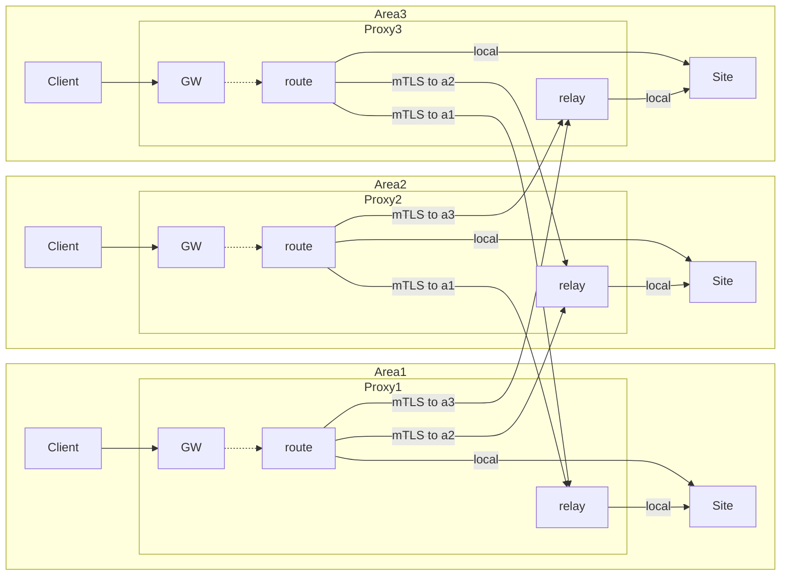

# g3proxy用户指南

**目录**

- [如何安装](#如何安装)
- [基础概念](#基础概念)
    + [服务管理](#服务管理)
    + [热升级](#热升级)
    + [配置结构](#配置结构)
    + [监控](#监控)
- [基础用法](#基础用法)
    + [HTTP代理](#http代理)
    + [SOCKS代理](#socks代理)
    + [TCP映射](#tcp映射)
    + [TLS封装](#tls封装)
    + [SNI代理](#sni代理)
    + [线路绑定](#线路绑定)
    + [代理串联](#代理串联)
    + [连接限速](#连接限速)
    + [安全解析](#安全解析)
    + [容灾解析](#容灾解析)
    + [用户认证授权](#用户认证授权)
    + [用户限流限速](#用户限流限速)
- [进阶用法](#进阶用法)
    + [多协议入口复用](#多协议入口复用)
    + [监听多个端口](#监听多个端口)
    + [Socks5 UDP IP映射](#socks5-udp-ip映射)
    + [安全反向代理](#安全反向代理)
    + [域名解析劫持](#域名解析劫持)
    + [动态线路绑定](#动态线路绑定)
    + [动态代理串联](#动态代理串联)
    + [用户特定站点监控](#用户特定站点监控)
    + [流量审计](#流量审计)
    + [性能优化](#性能优化)
- [场景设计](#场景设计)
    + [多区域加速](#多区域加速)

## 如何安装

目前只支持Linux系统，并对Debian、RHEL等发行版提供了打包安装支持，
参考[发行&打包步骤](/README.md#release-and-packaging)完成打包后直接在目标系统上安装即可。

## 基础概念

### 服务管理

单机可以部署多个g3proxy服务，通过systemd实例服务进行管理，每个实例对应为为一个g3proxy进程组（daemon_group），
每个进程组都有一个unix socket文件进行本地RPC管理。

每个服务有一个入口配置文件，yaml格式，后缀可更改，但需要保持所有引用的配置文件均具有相同的后缀。下文将使用*main.yml*指代入口配置文件。

使用发行版原生安装包安装的，已经安装了systemd参数化服务配置文件，参数就是进程组名称，
对应的入口配置文件存放路径为`/etc/<daemon_group>/main.yml`。

未使用安装包安装的，可以参考[g3proxy@.service](service/g3proxy@.latest.service)自行设计服务化使用方式。

### 热升级

默认的systemd服务配置支持热升级，执行步骤如下：

1. 安装新版本包
2. 执行`systemctl daemon-reload`加载新版本服务配置
3. 执行`systemctl restart g3proxy@<daemon_group>`，启动新进程，并通知老进程离线

老进程离线后会等待原有任务退出，或等待一段时间（默认10小时）后强制下线。

热升级机制类似nginx reload，受操作系统限制socket释放时会有一定几率导致新连接请求被丢弃，Linux 5.14及以后的版本引入
[tcp_migrate_req](https://docs.kernel.org/networking/ip-sysctl.html)选项，打开后可确保连接不丢失。

### 配置结构

g3proxy采用模块化方式进行功能设计，主要包含以下功能模块：

1. 入口 | Server

    负责接受客户端请求并进行处理，会调用 出口&用户&审计 模块的功能。
    *Port*类型的入口可以放在非端口类型入口前面进行串联。

2. 出口 | Escaper

    负责对目标地址进行连接及控制，会调用 解析 模块的功能。
    *Route*类型的出口可放在其他出口前进行串联。

3. 解析 | Resolver

    提供域名解析功能。
    *Failover*解析可以放在其他解析前面进行串联。

4. 用户组 | UserGroup

    提供用户认证&授权功能

5. 审计 | Auditor

    提供流量审计功能

这些模块的配置可以跟*main.yml*写在一起，也可以使用独立的配置文件进行管理，后者可以进行独立的重载（reload）操作。

除了以上模块的配置，包括线程/日志/监控等，均需要写在*main.yml*中。

单一文件配置可参考[examples/inspect_http_proxy](examples/inspect_http_proxy)，
拆分文件配置可参考[examples/hybrid_https_proxy](examples/hybrid_https_proxy)。

下文示例将不展示完整配置文件，仅对相关涉及的部分进行展示，完整示例参考[examples](examples)。

### 监控

为方便接入各种监控解决方案，G3项目统一使用[StatsD](https://www.datadoghq.com/blog/statsd/)作为监控打点输出协议，
用户可以根据自己的实际情况选择合适的StatsD实现（例如[gostatsd](https://github.com/atlassian/gostatsd)），配置好然后接入自己的监控系统。

g3proxy的监控配置在主配置文件*main.yml*中进行配置，示例如下：

```yaml
stat:
  target:
    udp: 127.0.0.1:8125 # StatsD的UDP套接字地址
    # unix: /run/statsd.sock
  prefix: g3proxy       # 打点名称前缀，比如 server.task.total 会转变为 g3proxy.server.task.total
  emit_duration: 200ms  # 打点间隔
```

具体metrics定义在 [metrics](doc/metrics) 文件夹下，建议生成sphinx html文档后查看。

## 基础用法

### HTTP代理

入口启用HTTP代理，需要添加HttpProxy类型入口，示例如下：

```yaml
server:
  - name: http       # 名称需要唯一，不跟其他入口冲突，日志&监控需要使用该字段
    escaper: default # 必填，可以是任意类型出口
    type: http_proxy
    listen:
      address: "[::]:8080"
    tls_client: {}   # 打开7层https forward转发支持
```

### SOCKS代理

入口启用Socks代理，需要添加SocksProxy类型入口，示例如下：

```yaml
server:
  - name: socks        # 名称需要唯一，不跟其他入口冲突，日志&监控需要使用该字段
    escaper: default   # 必填，可以是任意类型出口
    type: socks_proxy
    listen:
      address: "[::]:10086"
    enable_udp_associate: true # 使用标准UDP Associate功能，否则使用简化UDP Connect功能（Peer限制唯一）
    udp_socket_buffer: 512K    # 配置客户端侧双向UDP Socket Buffer Size
```

### TCP映射

本地TCP端口映射到目标机器的特定端口，需要添加TcpStream类型入口，示例如下：

```yaml
server:
  - name: tcp           # 名称需要唯一，不跟其他入口冲突，日志&监控需要使用该字段
    escaper: default    # 必填，可以是任意类型出口
    type: tcp_stream
    listen:
      address: "[::1]:10086"
    proxy_pass:         # 目标地址，可以单条/多条
      - "127.0.0.1:5201"
      - "127.0.0.1:5202"
    upstream_pick_policy: rr # 负载均衡算法，默认random
```

### TLS封装

本地TLS端口映射到目标机器的特定端口，需要添加TlsStream类型入口，示例如下：

```yaml
server:
  - name: tls           # 名称需要唯一，不跟其他入口冲突，日志&监控需要使用该字段
    escaper: default    # 必填，可以是任意类型出口
    type: tls_stream
    listen:
      address: "[::1]:10443"
    tls_server:                   # 配置TLS参数
      certificate: /path/to/cert
      private_key: /path/to/key
      enable_client_auth: true    # 启用mTLS
    proxy_pass:         # 目标地址，可以单条/多条
      - "127.0.0.1:5201"
      - "127.0.0.1:5202"
    upstream_pick_policy: rr # 负载均衡算法，默认random
```

### SNI代理

自动识别TLS SNI / HTTP Host头中的目标地址，并转发，需要添加SniProxy类型入口，示例如下：

```yaml
server:
  - name: sni          # 名称需要唯一，不跟其他入口冲突，日志&监控需要使用该字段
    escaper: default   # 必填，可以是任意类型出口
    type: sni_proxy
    listen:
      address: "[::]:443" # 监听443端口，但可以同时支持发往该端口的TLS & HTTP协议流量
```

### 线路绑定

机器上具有多条网络线路，需要绑定其中一条访问目标网站时，需要在出口指定Bind的IP,以DirectFixed出口为例：

```yaml
escaper:
  - name: default        # 名称需要唯一，不跟其他入口冲突，日志&监控需要使用该字段
    type: direct_fixed
    resolver: default
    resolve_strategy: IPv4First # 出口支持HappyEyeballs算法，解析目标地址时v4优先
    bind_ip: 192.168.10.1   # 可以使用list设置多个地址
resolver:
  - name: default
    type: c-ares
    server: 223.5.5.5
    bind_ipv4: 192.168.10.1 # 解析也需要绑定同一条线路，确保就近解析
```

### 代理串联

需要使用其他代理进行串联时，需要使用*Proxy*类型的出口，以ProxyHttps为例：

```yaml
escaper:
  - name: next_proxy    # 名称需要唯一，不跟其他入口冲突，日志&监控需要使用该字段
    type: proxy_https
    resolver: default   # 代理地址包含域名时必须设置
    proxy_addr: next-proxy.example.net:8443 # 也可以列表填写多个代理地址
    http_forward_capability:
      forward_ftp: true   # 直接转发FTP over HTTP请求给下一级代理处理，若否则在本地进行FTP请求
      forward_https: true # 直接转发https forward请求给下一级代理处理，若否则在本地进行TLS握手
    tls_client:
      ca_certificate: rootCA.pem # 用于验证下一级代理的CA证书，不设置时默认用系统默认安装的CA证书
    tls_name: example.com # 代理地址不包含域名时，如果需要用DNS Name验证证书，则需要设置
```

### 连接限速

入口、出口均支持全局维度单连接限速，配置key相同，在对应的server & escaper里设置：

```yaml
tcp_sock_speed_limit: 10M/s
udp_sock_speed_limit: 10M/s
```

入口配置针对的是Client-Proxy的连接，出口配置针对的是Proxy-Target的连接。

### 安全解析

需要使用非明文的方式访问DNS递归解析服务器时，需要使用trust-dns解析，示例如下：

```yaml
resolver:
  - name: default
    type: trust-dns
    server: 1.1.1.1
    encryption: dns-over-https # 此外也支持 dns-over-tls、dns-over-quic
```

### 容灾解析

单一DNS递归解析服务器不稳定时，可以使用Failover类型解析，示例如下：

```yaml
resolver:
  - name: virtual
    type: fail_over
    primary: alidns
    standby: dnspod
  - name: alidns
    type: c-ares
    server: 223.5.5.5 223.6.6.6
  - name: dnspod
    type: c-ares
    server: 119.29.29.29
```

### 用户认证授权

Http代理&Socks5代理都支持进行用户验证，需要搭配UserGroup进行配置，整体配置参考[examples/simple_user_auth](examples/simple_user_auth)，用户组示例如下：

```yaml
user_group:
  - name: default
    static_users:
      - name: root
        # password: toor
        token:                                           # 认证token
          salt: 113323bdab6fd2cc
          md5: 5c81f2becadde7fa5fde9026652ccc84
          sha1: ff9d5c1a14328dd85ee95d4e574bd0558a1dfa96
        dst_port_filter:          # 放行端口
          - 80
          - 443
        dst_host_filter_set:      # 放行地址
          exact:
            - ipinfo.io           # 允许访问ipinfo.io
            - 1.1.1.1
          child:
            - "ipip.net"          # 允许访问 myip.ipip.net
          regex:
            - "lum[a-z]*[.]com$"  # 允许访问 lumtest.com
    source:                       # 动态用户，静态用户优先匹配，无静态用户时匹配动态用户
      type: file                  # 从文件定期加载，此外支持通过lua/python脚本加载并缓存
      path: dynamic_users.json
```

用户验证token生成需要使用[scripts/passphrase_hash.py](/scripts/passphrase_hash.py)脚本。

### 用户限流限速

用户维度支持单连接限速、RPS限制、并发任务总数限制：

```yaml
tcp_sock_speed_limit: 10M/s # TCP单连接双向分别限速10M/s
udp_sock_speed_limit: 10M/s # UDP单连接双向分别限速10M/s
tcp_conn_rate_limit: 1000/s # Client-Proxy新建连接速率限制
request_rate_limit: 2000/s  # 新增代理请求数速率限制
request_max_alive: 2000     # 存活任务总数限制 
```

## 进阶用法

### 多协议入口复用

如果需要单个端口同时用于HttpProxy & SocksProxy，可以使用IntelliProxy Port入口：

```yaml
server:
  - name: intelli
    type: intelli_proxy
    listen: "[::]:8080"
    http_server: http        # 对HTTP请求直接发送给http server处理
    socks_server: socks      # 对socks请求直接发送给socks server处理
  - name: http
    type: HttpProxy
    listen: "127.0.0.1:2001" # 监听本地地址防止滥用，本身不会被使用
  - name: socks
    type: SocksProxy
    listen: "127.0.0.1:2002" # 监听本地地址防止滥用，本身不会被使用
```

### 监听多个端口

相同的服务配置需要监听多个端口时，可以在Server前串联Port类型的入口。

SNI Proxy监听多个端口示例如下：

```yaml
server:
  - name: sni          # 名称需要唯一，不跟其他入口冲突，日志&监控需要使用该字段
    escaper: default   # 必填，可以是任意类型出口
    type: sni_proxy
    listen:
      address: "[::]:443" # 监听443端口，但可以同时支持发往该端口的TLS & HTTP协议流量
  - name: port80
    type: plain_tcp_port
    listen: "[::]:80"  # 监听80端口
    server: sni_proxy  # 所有连接给到sni_proxy server处理
```

HTTP Proxy同时开放明文端口及TLS端口示例如下：

```yaml
server:
  - name: http       # 名称需要唯一，不跟其他入口冲突，日志&监控需要使用该字段
    escaper: default # 必填，可以是任意类型出口
    type: http_proxy
    listen: "[::]:8080"
    tls_client: {}   # 打开7层https forward转发支持
  - name: tls
    type: plain_tls_port
    listen: "[::]:8443"
    server: http
    tls_server:
      certificate: /path/to/certificate
      private_key: /path/to/private_key
      enable_client_auth: true            # 开启mTLS
```

Port类型入口仅有独立的Listen监控，流量监控、日志都是在下一跳Server处理的，在规划时需要考虑清楚是串联Port还是拆分Server更合适。

### Socks5 UDP IP映射

Socks5 UDP处理时需要给客户端发送UDP数据连接的地址，一般是发送本地的IP:Port，有些情况下Client无法直接访问代理本地的IP地址，
这时候需要在socks server中配置映射表：

```yaml
auto_reply_local_ip_map:
  "192.168.10.2": "192.168.30.2"
```

### 安全反向代理

很多软件会暴露HTTP API或者metrics接口出去，他们本身的安全防护策略都比较简单，可以使用如下配置进行加固：

```yaml
server:
  - name: plain
    escaper: default
    user-group: default                     # 启用用户认证
    type: http_rproxy
    listen:
      address: "[::]:80"
    no_early_error_reply: true              # 请求确认合法前禁止错误返回，端口防扫描
    hosts:
      - exact_match: service1.example.net   # 匹配该域名
        upstream: 127.0.0.1:8081            # 路径/全部转发
      - exact_match: service2.example.net   # 匹配该域名
        set_default: true                   # 若域名没有匹配的，作为默认站点
        upstream: 127.0.0.1:8082            # 路径/全部转发
    # 可通过tls_server启用TLS,或通过前置plain_tls_port添加独立的TLS端口
```

### 域名解析劫持

有很多情况会希望绕过正常的DNS解析流程使用特殊域名解析规则，在用户配置中可做如下配置：

```yaml
resolve_redirection:
  - exact: t1.example.net # 固定到具体IP
    to: 192.168.10.1
  - exact: t2.example.net # CNAME
    to: t1.example.net
  - child: example.com    # *.example.com 替换为 *.example.net
    to: example.net
```

### 动态线路绑定

有些机器的IP是动态获取的，比如通过DHCP或PPP拨号，这些IP可以动态绑定到DirectFloat出口中：

代理配置：

```yaml
escaper:
  - name: float
    type: direct_float
    resolver: default
```

使用如下指令进行更新：

```shell
g3proxy-ctl -G <daemon_group> -p <pid> escaper float publish "{\"ipv4\": \"192.168.10.1\"}"
```

### 动态代理串联

在爬虫场景，很多获取的代理地址都是动态带有效期的，可以封装一层中转代理，通过辅助程序自动处理过期代理替换，这样客户端只需要设置固定的代理地址：

代理配置：

```yaml
escaper:
  - name: float
    type: proxy_float
    source:
      type: passive   # 接受推送，也可以配置为定期从redis获取
```

使用如下指令进行更新：

```shell
g3proxy-ctl -G <daemon_group> -p <pid> escaper float publish '{"type":"socks5","addr":"127.0.0.1:11080", "expire": "<rfc3339 datetime>"}'
```

其中type还可以支持http、https。

### 用户特定站点监控

在用户配置中，可以继续对站点进行维度划分，添加单独的监控或单独的配置：

```yaml
explicit_sites:
  - id: example-net
    child_match: example.net
    emit_stats: true           # 建立独立的监控，id字段会作为监控条目名称的一部分
    resolve_strategy:          # 可配置单独的解析策略
      query: ipv4only          # 仅解析ipv4地址
```

### 流量审计

开启流量审计功能完整配置参考[examples/inspect_http_proxy](examples/inspect_http_proxy)，审计模块配置示例如下：

```yaml
auditor:
  - name: default
    protocol_inspection: {} # 开启协议识别，使用默认参数
    tls_cert_generator: {}  # 开启TLS劫持，使用默认参数
    tls_interception_client: {} # 可配置代理对目标地址TLS连接参数
    h1_interception: {}         # HTTP/1.0 解析参数
    h2_interception: {}         # HTTP/2 解析参数
    icap_reqmod_service: icap://xxx  # ICAP REQMOD服务配置
    icap_respmod_service: icap://xxx # ICAP RESPMOD服务配置
    application_audit_ratio: 1.0     # 应用流量审计比例，按客户端代理请求匹配，若审计则进行协议识别及TLS劫持
```

### 性能优化

默认配置，代理会使用所有CPU核，并进行跨核任务调度，有些场景下绑CPU核会提升性能，可以如下配置：

在*main.yml*中配置worker：

```yaml
worker:
  thread_number: 8      # 不设置时，默认按所有CPU核数
  sched_affinity: true  # 开启绑核，默认按线程次序一一绑定
```

server配置监听时，可以配置按worker数目监听，并分散到各worker中：

```yaml
listen: "[::]:8080"
listen_in_worker: true
```

## 场景设计

### 多区域加速

可以使用g3proxy现有模块实现区域间加速功能。

以3个区域为例，整体拓扑如下：



每个节点的Proxy分别配置以下功能：

- GW

  处理当地的用户请求，可使用[SNI Proxy](#sni代理)进行4层加速，或使用[HTTP反向代理](#安全反向代理)进行7层加速。

  简化配置如下：

  ```yaml
  server:
    - name: port443
      type: sni_proxy
      escaper: route
    - name: port80
      type: http_rproxy
      escaper: route
  ```

- relay

  处理其他区域节点的请求，使用内部协议，例如使用mTLS通道。

  简要配置如下：

  ```yaml
  server:
    - name: relay
      type: http_proxy
      escaper: local
      tls_server: {} # 配置TLS参数
  ```

- route

  对当地的用户请求进行选路分流，需要配置 >=1 个route类型出口，一个本地出口，另外对每个区域配置一个Proxy出口。

  简化配置如下：

  ```yaml
  escaper:
    - name: route
      type: route_query  # 该模块可向外部agent查询选路规则，也可以用其他route出口模块
      query_allowed_next:
        - a1_proxy
        - a2_proxy
        - local
      fallback_node: local
      # ... agent配置
    - name: local
      type: direct_fixed
      # ... 出口配置
    - name: a1_proxy
      type: proxy_https
      tls_client: {} # 配置TLS参数
      # ... 配置代理参数 指向a1区域的 relay代理地址
    - name: a2_proxy
      type: proxy_https
      tls_client: {} # 配置TLS参数
      # ... 配置代理参数 指向a2区域的 relay代理地址
  ```
